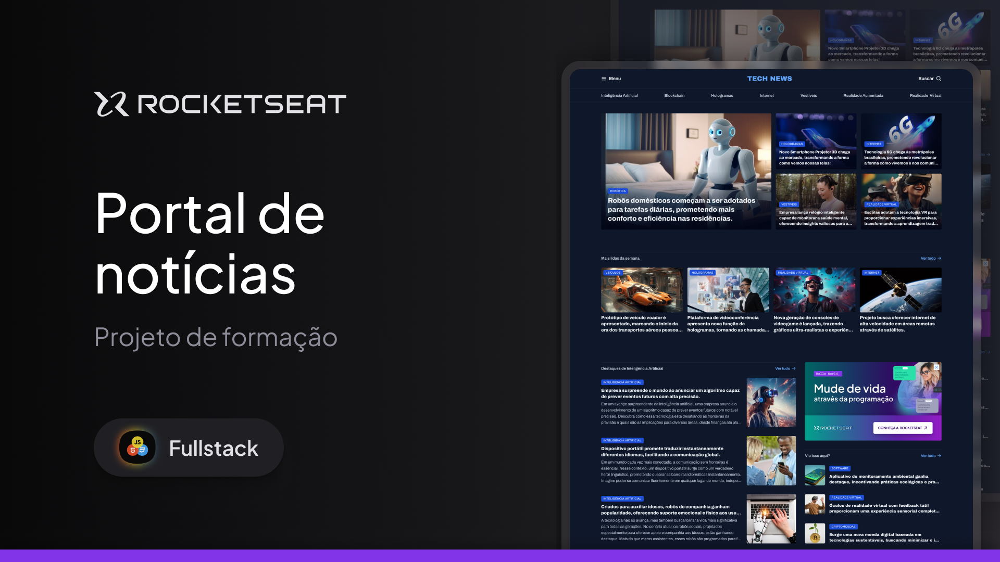

## 📖 Sobre

Projeto realizado dentro do curso de Desenvolvimento Web (BetaHub) na plataforma da Rocketseat para reforçar os conceitos de CSS para criação de páginas web.

  
    

 

## 💻 Tecnologias

Esse projeto foi desenvolvido com as seguintes tecnologias:

- HTML
- CSS
- Figma

 

## 🎨 Protótipo

O protótipo deste projeto foi criado no Figma e está disponível para visualização [aqui](https://www.figma.com/community/file/1362166020452569562). (Feito com amor por [Rocketseat](https://www.rocketseat.com.br) 💜).

 

## 🚀 Visualizar o Projeto

O projeto pode ser visualizado [aqui](https://nicolevlc.github.io/projeto-portal-de-noticias/).

 

## 📝 Licença
Esse projeto está sob a licença MIT. Veja o arquivo **LICENSE** para mais detalhes.
